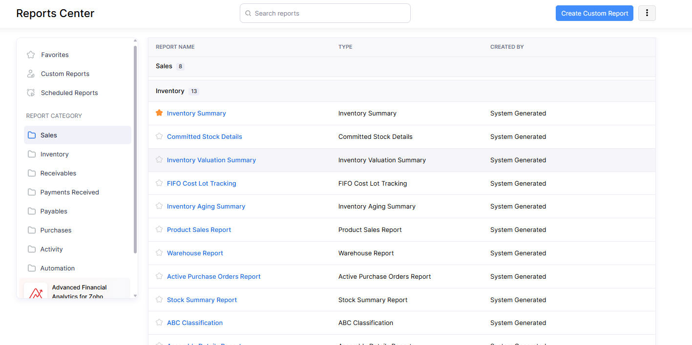

# Learning Web Development Projects

This repository contains my practice projects and experiments as I learn web development. It includes examples using HTML, CSS, JavaScript, and frameworks like React and Next.js. I'm building this to improve my skills and document my learning journey.

## 📋 To-Do List

- [x] Create a Menu File
- [ ] Create HTML Structure

## 💡Ideas

### Menu Design

- TODO: Replace with Figma Design

[]

### Card Design

- TODO: Replace with Figma Design

[]

### Star Rating Card

- TODO: Replace with Figma Design

[]
